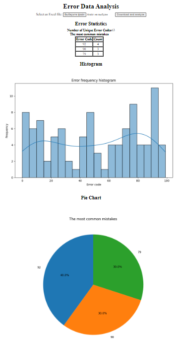

# Веб-приложение для анализа данных об ошибках станка с ЧПУ

Данное веб-приложение предназначено для анализа данных об ошибках, хранящихся в файле Excel. Он выполняет базовый анализ данных, создает визуализации и предоставляет информацию о наиболее часто встречающихся ошибках.

## Начало работы
### Установка

1. Склонируйте репозиторий:

   ```bash
   git clone https://github.com/Seliaev/AnalyzeDataError_cnc.git
   ```
   
2. Перейдите в директорию проекта:
   ```bash
    cd AnalyzeDataError_cnc
   ```

2. Установите необходимые пакеты Python:
   ```bash
    pip install -r requirements.txt
   ```
### Использование
1. Запустите приложение Flask:
   ```bash
   python main.py
   ```
2. Откройте веб-браузер и перейдите по адресу [http://localhost:5000](http://localhost:5000).
3. Загрузите файл Excel, содержащий данные об ошибках.
4. Исследуйте статистику ошибок, гистограмму и круговую диаграмму, сгенерированные приложением.
   
### Структура файлов
>main.py - Файл запуска приложения.
>generation_data.py - Модуль генерации (симуляции для тестов) данных.
>server/app.py: Модуль Flask.  
>server/templates/: HTML-шаблоны для веб-приложения.  
>server/static/: Статические файлы, включая стили CSS.  
>analyzer/analyzer.py: Модуль анализа данных об ошибках.  
>data/: Директория для хранения сгенерированных файлов Excel.

### Используемые библиотеки
>Flask==3.0.0  
>matplotlib==3.8.2  
>openpyxl==3.1.2  
>pandas==2.1.3  
>seaborn==0.13.0


<details>
  <summary>Скриншоты</summary>


  
</details>


# CNC Machine Error Data Analysis Web Application

This web application is designed for the analysis of error data from a CNC machine with a CNC control system. It performs basic data analysis, creates visualizations, and provides information about the most common errors.

## Getting Started

### Installation

1. Clone the repository:

   ```bash
   git clone https://github.com/Seliaev/AnalyzeDataError_cnc.git
   ```
2. Navigate to the project directory:
    ```bash
    cd AnalyzeDataError_cnc
    ```

3. Install the required Python packages:
    ```bash
    pip install -r requirements.txt
    ```
   
### Usage
1. Run the Flask application:
    ```bash
    python main.py
    ```
2. Open a web browser and go to [http://localhost:5000](http://localhost:5000).
3. Upload an Excel file containing error data.
4. Explore the error statistics, histogram, and pie chart generated by the application.

# File Structure
>main.py: Application launch file.  
>generation_data.py: Data generation (simulation for testing) module.  
>server/app.py: Flask module.  
>server/templates/: HTML templates for the web application.  
>server/static/: Static files, including CSS styles.   
>analyzer/analyzer.py: Error data analysis module.  
>data/: Directory for storing generated Excel files.

### Used libraries
>Flask==3.0.0  
>matplotlib==3.8.2  
>openpyxl==3.1.2  
>pandas==2.1.3  
>seaborn==0.13.0  


<details>
  <summary>Screenshots</summary>

  
</details>
